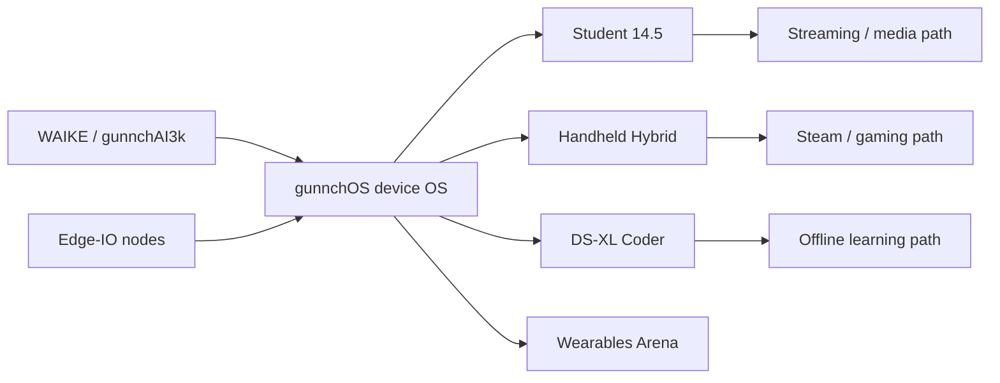

# Ecosystem Data Flow

See also [DATA_FLOW_AND_CONNECTOR_MAP.md](DATA_FLOW_AND_CONNECTOR_MAP.md).

This repository is moving from EVT-0 concept toward EVT-1 prototype RFQ package. It is not a final schematic package, not certified hardware, not FCC/CE approved, not DVT/PVT complete, and not a manufacturing release.
