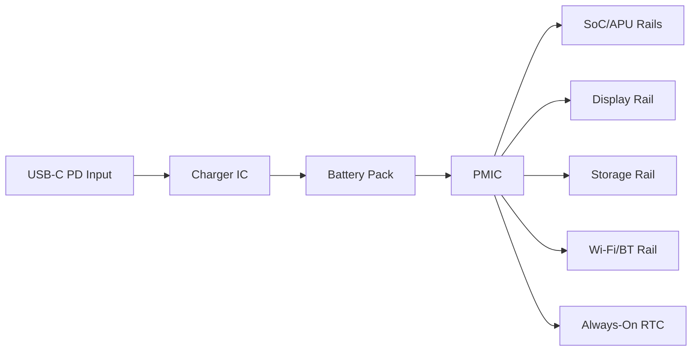

# Power Tree

```mermaid
flowchart LR
  USBC[USB-C PD Input] --> CHG[Charger IC]
  CHG --> BAT[Battery Pack]
  BAT --> PMIC[PMIC]
  PMIC --> SYS[SoC/APU Rails]
  PMIC --> DISP[Display Rail]
  PMIC --> NVMe[Storage Rail]
  PMIC --> RF[Wi-Fi/BT Rail]
  PMIC --> AON[Always-On RTC]
```

**Safety:** Requires EE review. EVT-1 skeleton only.
