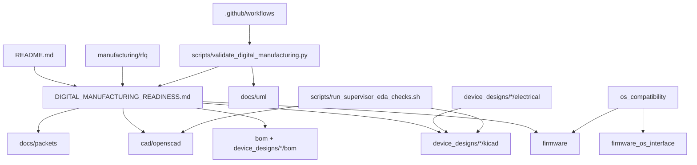

# Component — current

Components are **files and packages in this repo**, plus the OS sibling contract. There is no factory API.

OS sibling: `gunnchos-device-os` consumes `os_compatibility/device_class_exports/` as profile mirrors only.
