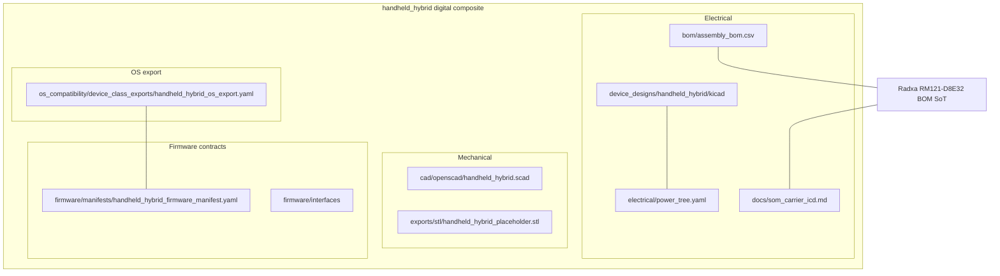

# Composite structure — current

Nested parts of one first-party SKU as represented **digitally**. Example: Handheld Hybrid (public SoM pinout). Other SKUs share the same outer ports with different inner compute (COM-HPC or nRF or dock controllers).

Ports to the environment: USB-C (VBUS), debug UART, optional WWAN footprint, OS profile name `handheld_hybrid`. NDA COM-HPC internals are **not** part of this composite.
