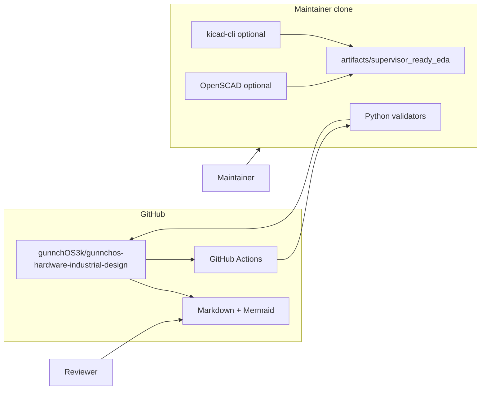

# Deployment — current

```mermaid
flowchart LR
  subgraph github [GitHub]
    REPO[gunnchOS3k/gunnchos-hardware-industrial-design]
    GHA[GitHub Actions]
    MD[Markdown + Mermaid]
  end
  subgraph local [Maintainer clone]
    PY[Python validators]
    KICAD[kicad-cli optional]
    OSCAD[OpenSCAD optional]
    ART[artifacts/supervisor_ready_eda]
  end
  DEV[Maintainer] --> local
  PY --> REPO
  KICAD --> ART
  OSCAD --> ART
  REPO --> MD
  REPO --> GHA
  GHA --> PY
  SUP[Reviewer] --> MD
```

No CM portal, no fab line, and no certification lab are deployed from this repository. GitHub + local CLI are the deployment surface.
