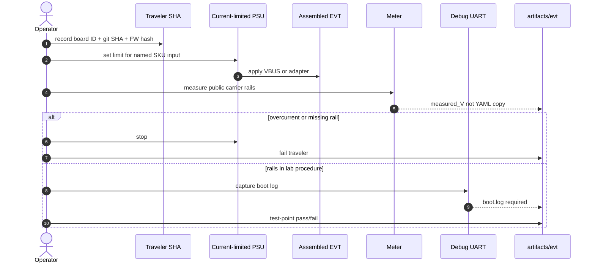

# Diagnostic / bring-up sequence — current (planned physical)

Sequence for an owner/lab operator after an EVT unit exists. Until then this is a **procedure diagram**, not an executed test.

Skip NDA-only module internals (`UNRES-COM-HPC-*`, `UNRES-JHL*`). Full prose: [PHYSICAL_EVT_BRINGUP_PACKET.md](../../packets/PHYSICAL_EVT_BRINGUP_PACKET.md).
