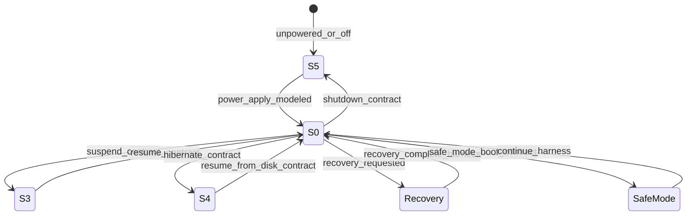

# Power / boot state machine — current (contract)

States from `firmware/interfaces/power_state_contract.yaml` (S0, S3, S4, S5) plus harness boot paths from `firmware/manifests/*_firmware_manifest.yaml`. **Harness only. Not proven on silicon.**

Handheld / Student / DS-XL manifests list `uefi_standard_boot`, `recovery_boot`, `safe_mode_boot`. Capsule update is `simulated_only`. Dock and rings do not claim UEFI on this diagram.

Physical bring-up must record measured rails before treating S0 as `DEVICE_MEASURED`. See [sequence_bringup.md](sequence_bringup.md).
