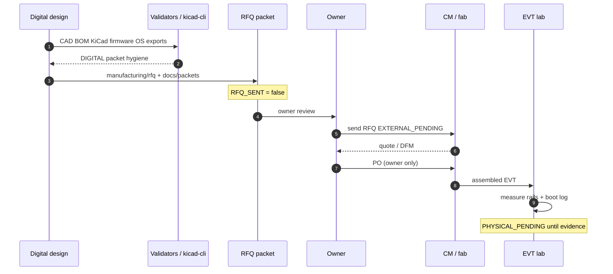

# Timing — digital packet vs physical gates

This is a **process timing** diagram (not a PCB SI timing closure). SI simulation is explicitly `false` on handheld stackup.

No parallel claim that digital time equals fab time.
