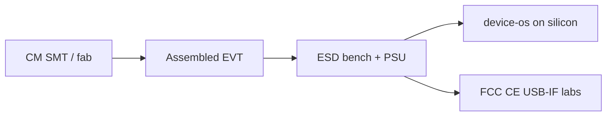

# Future — physical EVT lab and CM line

Not deployed. Shown so reviewers can see what is **out of scope** for the digital packet.

Each node is `PHYSICAL_PENDING` or `EXTERNAL_PENDING` until owner-executed evidence exists.
