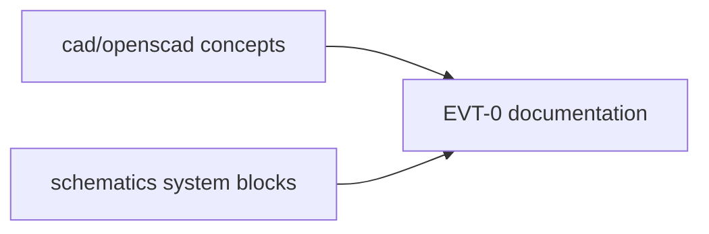

# Legacy — EVT-0 concept framing

Early tree: `cad/openscad/*.scad` concepts, `schematics/*_system_block.kicad_sch` skeletons, `docs/00_START_HERE.md` “not manufacturing-ready”.

Still true: those files are not production Gerbers and not certification. Current front door for manufacturing honesty is `DIGITAL_MANUFACTURING_READINESS.md` plus `docs/packets/`.

